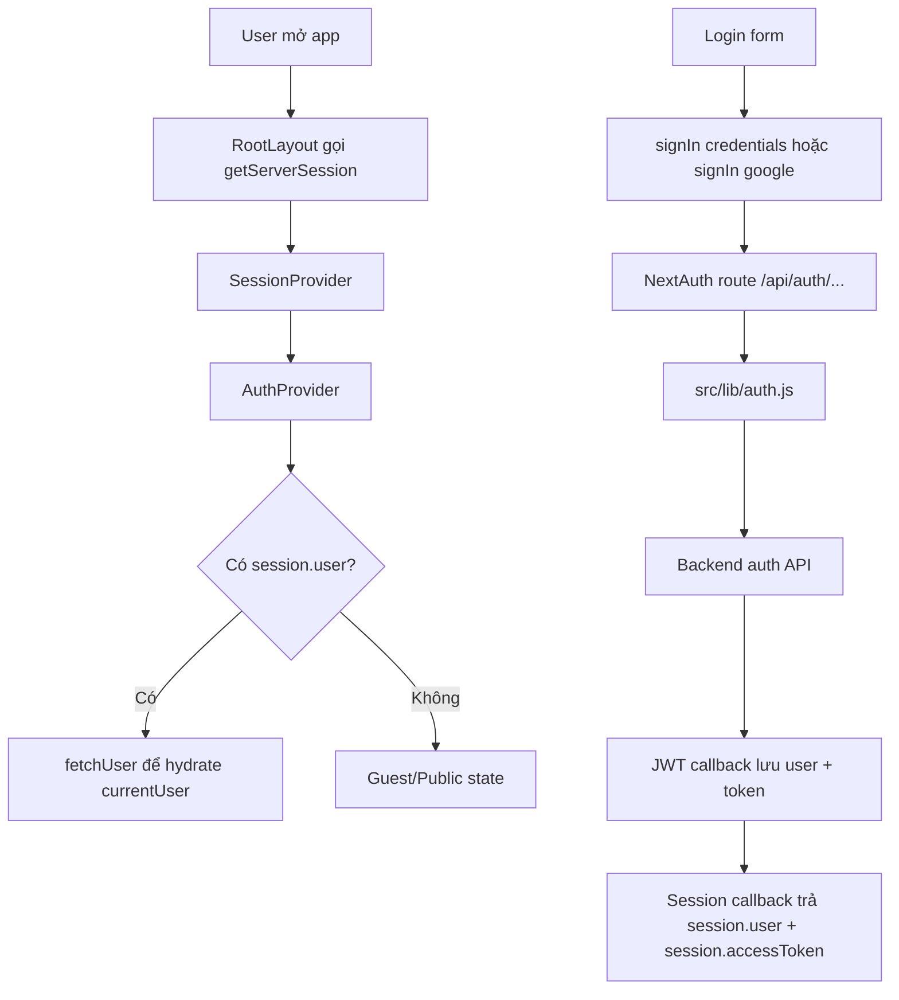

# Auth Flow

Tài liệu này mô tả luồng xác thực hiện tại của `mge-new`: NextAuth, backend auth API, cách session/JWT được tạo, và cách `services/api.js` gắn token vào request.

## File Chính

| File | Vai trò |
| --- | --- |
| `src/app/api/auth/[...nextauth]/route.js` | Mount NextAuth handler cho `GET` và `POST`. |
| `src/lib/auth.js` | Cấu hình NextAuth: providers, callbacks, refresh token. |
| `src/services/authApi.js` | Wrapper các backend auth endpoint: login, Firebase login, change tenant, refresh token, logout. |
| `src/app/(auth)/login/components/LoginForm/index.js` | UI login email/password và Google. |
| `src/app/(auth)/google-callback/page.js` | Callback page sau Google login. |
| `src/app/layout.js` | Lấy server session và bọc app bằng `SessionProvider` + `AuthProvider`. |
| `src/context/AuthProvider.js` | Hydrate `currentUser`, xử lý session hết hạn, logout client. |
| `src/services/api.js` | HTTP client trung tâm: lấy token từ session, gắn `Authorization`, dịch endpoint `protean/*`. |

## Tổng Quan



## NextAuth Route

NextAuth được expose tại:

```txt
src/app/api/auth/[...nextauth]/route.js
```

NextAuth tự tạo các route con như:

```txt
/api/auth/signin
/api/auth/signout
/api/auth/session
/api/auth/callback/credentials
/api/auth/callback/google
/api/auth/csrf
```

Handler dùng `authOptions` từ `src/lib/auth.js`.

## Cấu Hình Session/JWT

Trong `src/lib/auth.js`:

```js
session: {
  strategy: 'jwt',
  maxAge: 30 * 24 * 60 * 60,
},
jwt: {
  maxAge: 60 * 60 * 24 * 30,
  secret: process.env.NEXTAUTH_SECRET,
}
```

App dùng JWT strategy, không dùng database session.

Session page config:

```js
pages: {
  signIn: '/login',
  signOut: '/logout',
  error: '/error',
}
```

## Flow Login Email/Password

User submit form tại:

```txt
src/app/(auth)/login/components/LoginForm/index.js
```

Client gọi:

```js
signIn('credentials', {
  email,
  password,
  redirect: false,
})
```

Sau đó NextAuth chạy `CredentialsProvider.authorize()` trong `src/lib/auth.js`.

Luồng xử lý:

1. Validate có `email` và `password`.
2. Gọi backend:

   ```txt
   POST auth/login
   ```

3. Backend trả về `data.user`, `data.accessToken`, `data.refreshToken`.
4. Lấy user id từ:

   ```js
   data.user._id ?? data.user.id
   ```

5. Gọi đổi tenant:

   ```txt
   GET auth/change-tenant
   Authorization: Bearer <accessToken>
   ```

6. Nếu đổi tenant thành công, thay `accessToken` bằng token tenant.
7. Decode `accessToken` để lấy role đúng từ token:

   ```js
   role_name
   role_system
   is_super_admin
   ```

8. Return object user đã merge:

   ```js
   {
     ...data.user,
     ...vaiTheoToken,
     _id: userId,
     user_role,
     accessToken,
     refreshToken,
   }
   ```

9. NextAuth đưa object này vào callback `jwt`.

Điểm quan trọng: token từ `auth/login` là token toàn cục, có thể mang role không đúng tenant. Vì vậy flow hiện tại bắt buộc gọi `auth/change-tenant` để lấy token có role/policy đúng theo tenant.

## Flow Login Google

User bấm Google login tại `LoginForm`:

```js
signIn('google', {
  callbackUrl: `${window.location.origin}/google-callback`,
})
```

Provider Google được cấu hình trong `src/lib/auth.js` với:

```js
prompt: 'consent'
access_type: 'offline'
response_type: 'code'
```

Luồng xử lý trong callback `signIn({ user, account })`:

1. Nếu `account.provider === 'google'` và có `account.access_token`.
2. Gọi Firebase:

   ```js
   signInWithGoogleToFirebase(account.access_token)
   ```

3. Lấy Firebase ID token:

   ```js
   firebaseAuth.firebaseIdToken
   ```

4. Gọi backend:

   ```txt
   POST auth/login-firebase
   header firebase: <firebaseIdToken>
   ```

5. Gán data backend vào object `user` bằng `Object.assign`, để callback `jwt` nhận được:

   ```js
   accessToken
   refreshToken
   firebaseToken
   ...data.user
   ```

6. Sau khi NextAuth hoàn tất, browser về:

   ```txt
   /google-callback
   ```

7. Page `google-callback` gọi `getSession()`, nếu có `session.user` thì set current user và redirect về `/`.

Lưu ý hiện tại: nếu Firebase/backend login lỗi, callback đang `return true`. Điều này có thể khiến Google OAuth vẫn đi tiếp nhưng session sau đó không có backend token hợp lệ.

## JWT Callback

Trong `src/lib/auth.js`, callback `jwt` xử lý:

1. Nếu có `user` ở lần login đầu tiên:

   ```js
   Object.assign(token, user)
   delete token.role
   ```

2. Nếu `user.accessToken` tồn tại, decode để set:

   ```js
   token.exp = decoded.exp
   ```

3. Nếu token đang lỗi hoặc không có access token:

   ```js
   return {}
   ```

4. Nếu access token hết hạn:

   ```js
   refreshAccessToken(token)
   ```

5. Nếu refresh fail:

   ```js
   return { error: 'RefreshAccessTokenError' }
   ```

## Refresh Token

Hàm `refreshAccessToken(token)` gọi:

```txt
POST auth/refresh-token
body: {
  refresh_token: token.refreshToken
}
```

Nếu thành công, token mới được merge lại:

```js
{
  ...token,
  accessToken: data.accessToken,
  refreshToken: data.refreshToken || token.refreshToken,
  exp: jwtDecode(data.accessToken).exp,
}
```

Nếu thất bại, token được đánh dấu:

```js
{
  ...token,
  error: 'RefreshAccessTokenError',
}
```

## Session Callback

Callback `session({ session, token })`:

1. Nếu token có lỗi refresh:

   ```js
   session.error = 'RefreshAccessTokenError'
   ```

2. Copy toàn bộ token vào:

   ```js
   session.user = { ...token }
   ```

3. Gắn access token ở root:

   ```js
   session.accessToken = token.accessToken
   ```

Vì vậy trong app hiện tại, `session.user` không chỉ là profile user, mà còn chứa cả token fields và role fields.

## Root Layout Và Client Auth Context

Trong `src/app/layout.js`:

```js
const session = await getServerSession(authOptions);
```

Sau đó app được bọc:

```jsx
<SessionLayout session={session}>
  <AuthProvider session={session}>
    <Layout>{children}</Layout>
    <Toaster richColors />
  </AuthProvider>
</SessionLayout>
```

`SessionLayout` chỉ bọc `SessionProvider` của NextAuth.

`AuthProvider` làm thêm các việc:

1. Nếu `session.error === 'RefreshAccessTokenError'` thì logout.
2. Nếu có `session.user`, gọi `fetchUser(session.user)`.
3. `fetchUser` gọi `userApi().getProfile(...)` để hydrate `currentUser`.
4. Load JSON schema qua `refApi().getList(...)`.
5. Expose context:

   ```js
   user
   currentUser
   setCurrentUser
   logout
   fetchUser
   jsonSchema
   permission_create_course
   full_permission
   ```

## API Wrapper Và Token Injection

`src/services/api.js` là HTTP client trung tâm.

Hàm token chính:

```js
async function getTokenOnce(isServer, serverSession) {
  if (isServer) {
    const session = serverSession || (await getServerSession(authOptions));
    return session?.accessToken ?? null;
  }
  return await getClientTokenOnce();
}
```

Phía server:

```js
getServerSession(authOptions)
```

Phía client:

```js
getSession()
```

Client token được cache trong:

```js
globalThis.__TOKEN_STORE__
```

Mục đích là tránh nhiều request client cùng lúc gọi `getSession()` lặp lại.

Khi gọi API:

```js
const _token = skipAuth ? null : await getTokenOnce(isServer, serverSession);
```

Nếu có token:

```js
fetchOptions.headers['Authorization'] = `Bearer ${_token}`;
```

Nếu không có token và là một số request đọc public, wrapper có thể chuyển sang path `/front`.

## Backend Auth Endpoints

Các endpoint auth thật đang dùng:

| Endpoint | Method | Dùng ở đâu | Mục đích |
| --- | --- | --- | --- |
| `auth/login` | `POST` | `authApi().login` | Login email/password. |
| `auth/login-firebase` | `POST` | `authApi().loginByFirebase` | Login backend bằng Firebase ID token sau Google OAuth. |
| `auth/change-tenant` | `GET` | `authApi().changeTenant` | Đổi token toàn cục sang token đúng tenant. |
| `auth/refresh-token` | `POST` | `authApi().refreshToken` | Refresh access token khi hết hạn. |
| NextAuth `signOut()` | Client call | `authApi().logout` | Clear NextAuth session/cookie. |

## Route Protection Hiện Tại

Hiện chưa có middleware hoặc protected layout toàn cục cho tất cả private routes.

Các route đang tự protect rải rác bằng:

```js
const session = await getServerSession(authOptions);
if (!session || !session?.user?.id) {
  return notFound();
}
```

Ví dụ:

```txt
src/app/(social)/me/layout.js
src/app/(social)/me/page.js
src/app/(course)/course/[id]/lesson/[lessonId]/page.js
src/app/(manager)/manager/course/(super-admin)/layout.js
```

Group page:

```txt
src/app/(social)/g/[groupId]/page.js
```

không bắt buộc login toàn cục. Page dựa vào `group_detail.joined` và `type`:

```js
joined || type?.[0] === 'public'
```

nếu không thì hiện trạng thái "Chưa tham gia".

Khu quản lý group dùng:

```txt
src/components/auth/ProtectedGroupRoute/index.js
```

Nó kiểm:

1. Có group detail.
2. User đã `joined`.
3. Nếu `requireManage`, role phải thuộc:

   ```js
   ['owner', 'manager']
   ```

## Logout

`AuthProvider.logout()` gọi:

```js
await authApi().logout();
```

`authApi().logout()` gọi:

```js
signOut({ redirect: false, redirect: false });
```

Sau đó `AuthProvider`:

1. Clear `currentUser`.
2. Clear `globalThis.__TOKEN_STORE__`.
3. Redirect về `/`.
4. `router.refresh()`.

## Điểm Cần Chú Ý

1. `api.js` không phải chỉ là fetch wrapper. Nó còn là compatibility layer dịch `protean/*` sang MangoX, build body, normalize response, và merge dữ liệu composite.
2. `session.user` đang chứa cả token và user profile fields. Khi dùng trong UI cần cẩn thận không serialize/log token ra ngoài.
3. Google flow hiện đang `return true` cả khi Firebase/backend login lỗi. Nên cân nhắc `return false` hoặc redirect error nếu muốn tránh session rỗng.
4. Chưa có auth guard toàn cục. Các private route đang protect rải rác trong layout/page.
5. `mediaApi.js` có `login` và `logout` giống code cũ. `logout` gọi `signOut()` nhưng file không import `signOut`, nên nhánh này có thể lỗi nếu được dùng.
6. `auth/change-tenant` là bước quan trọng để policy backend nhận đúng role/tenant. Không nên bỏ qua bước này trong credentials login.

## Flow Ngắn Gọn

```txt
Credentials login:
LoginForm
 -> signIn('credentials')
 -> NextAuth authorize()
 -> POST auth/login
 -> GET auth/change-tenant
 -> decode role from tenant token
 -> jwt callback
 -> session callback
 -> redirect
 -> AuthProvider fetchUser()

Google login:
LoginForm
 -> signIn('google')
 -> Google OAuth
 -> signIn callback
 -> Firebase login bằng Google access token
 -> POST auth/login-firebase
 -> jwt callback
 -> session callback
 -> /google-callback
 -> redirect /

API request:
service function
 -> api()
 -> getServerSession/getSession
 -> attach Authorization Bearer token
 -> translate protean if needed
 -> fetch backend
 -> normalize/merge response
```
